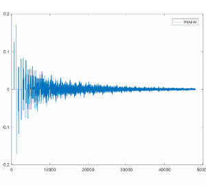

###Feedback Delay Network  
  
clone this branch :  
> git clone -b fdn --single-branch https://github.com/bmFicg/audioexp.git  
  
#### using the *.bat file to build on Windows  
  
assuming gcc compiler and ffmpeg / ffplay is set in PATH system environment variable  
> **_NOTE:_**  Linux remove the underscore in _popen function

the program  
- will render an 8 seconds audiosampel with kick and snare to a sound.wav file  
- play it using ffplay  
  
    
ffplay screenshot  
  
  
octave plot  
  
